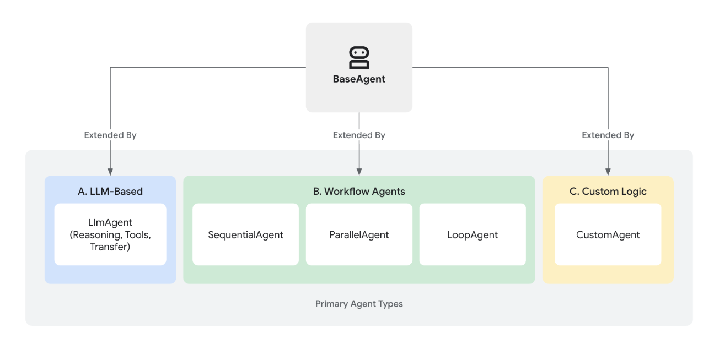
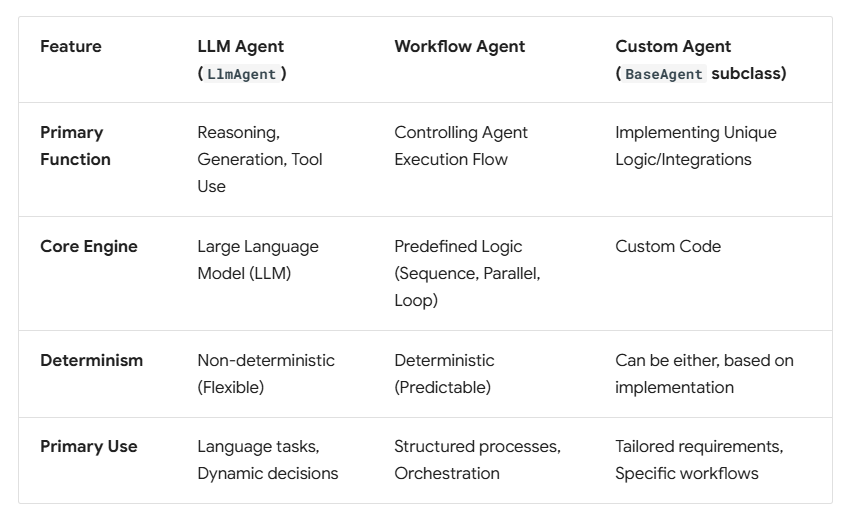
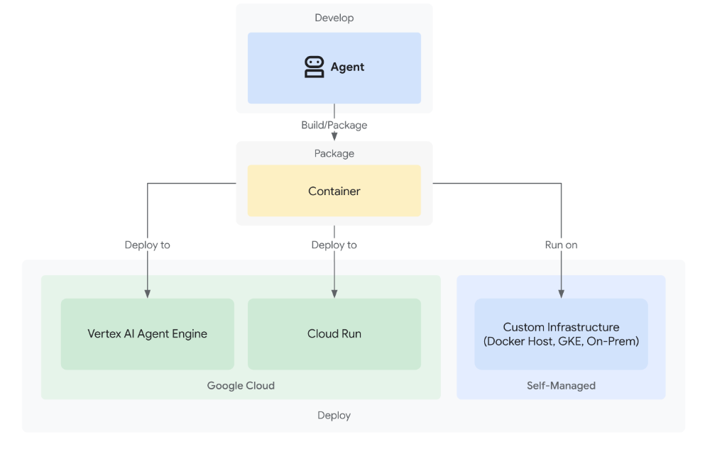

# Agent Development Kit (ADK):

Agent Development Kit (ADK) is designed to empower developers to quickly build, manage, evaluate and deploy AI-powered agents.

In Agent Development Kit (ADK), an Agent is a self-contained execution unit designed to act autonomously to achieve specific goals. Agents can perform tasks, interact with users, utilize external tools, and coordinate with other agents.

# Core Agent Categories:


## 1. LLM Agents (LlmAgent, Agent): 
These agents utilize Large Language Models (LLMs) as their core engine to understand natural language, reason, plan, generate responses, and dynamically decide how to proceed or which tools to use, making them ideal for flexible, language-centric tasks.

## 2. Workflow Agents (SequentialAgent, ParallelAgent, LoopAgent): 
These specialized agents control the execution flow of other agents in predefined, deterministic patterns (sequence, parallel, or loop) without using an LLM for the flow control itself, perfect for structured processes needing predictable execution.

## 3. Custom Agents: 
Created by extending BaseAgent directly, these agents allow you to implement unique operational logic, specific control flows, or specialized integrations not covered by the standard types, catering to highly tailored application requirements.

## Choosing the Right Agent Type:



# Defining the Agent's Identity and Purpose:

First, you need to establish what the agent is and what it's for.

## name (Required): 
Every agent needs a unique string identifier. This name is crucial for internal operations, especially in multi-agent systems where agents need to refer to or delegate tasks to each other. Choose a descriptive name that reflects the agent's function (e.g., customer_support_router, billing_inquiry_agent). Avoid reserved names like user.

## description (Optional, Recommended for Multi-Agent): 
Provide a concise summary of the agent's capabilities. This description is primarily used by other LLM agents to determine if they should route a task to this agent. Make it specific enough to differentiate it from peers (e.g., "Handles inquiries about current billing statements," not just "Billing agent").

## model (Required): 
Specify the underlying LLM that will power this agent's reasoning. This is a string identifier like "gemini-2.5-flash". The choice of model impacts the agent's capabilities, cost, and performance. See the Models page for available options and considerations.

## instruction (Required): 
The instruction parameter is arguably the most critical for shaping an LlmAgent's behavior. It's a string (or a function returning a string) that tells the agent:

- Its core task or goal.
- Its personality or persona (e.g., "You are a helpful assistant," "You are a witty pirate").
- Constraints on its behavior (e.g., "Only answer questions about X," "Never reveal Y").
- How and when to use its tools. You should explain the purpose of each tool and the circumstances under which it should be called, supplementing any descriptions within the tool itself.
The desired format for its output (e.g., "Respond in JSON," "Provide a bulleted list").

## tools (Optional):
Provide a list of tools the agent can use.

## generate_content_config (Optional):
Pass an instance of google.genai.types.GenerateContentConfig to control parameters like temperature (randomness), max_output_tokens (response length), top_p, top_k, and safety settings.

## input_schema (Optional): 
Define a schema representing the expected input structure. If set, the user message content passed to this agent must be a JSON string conforming to this schema. Your instructions should guide the user or preceding agent accordingly.

## output_schema (Optional): 
Define a schema representing the desired output structure. If set, the agent's final response must be a JSON string conforming to this schema.

## output_key (Optional): 
Provide a string key. If set, the text content of the agent's final response will be automatically saved to the session's state dictionary under this key. This is useful for passing results between agents or steps in a workflow.

## include_contents (Optional, Default: 'default'): 
Determines if the contents (history) are sent to the LLM.
- 'default': The agent receives the relevant conversation history.
- 'none': The agent receives no prior contents. It operates based solely on its current instruction and any input provided in the current turn (useful for stateless tasks or enforcing specific contexts).

## planner (Optional): 
Assign a BasePlanner instance to enable multi-step reasoning and planning before execution. There are two main planners:

- BuiltInPlanner: Leverages the model's built-in planning capabilities (e.g., Gemini's thinking feature).
- PlanReActPlanner: This planner instructs the model to follow a specific structure in its output: first create a plan, then execute actions (like calling tools), and provide reasoning for its steps. It's particularly useful for models that don't have a built-in "thinking" feature.

## code_executor (Optional): 
Provide a BaseCodeExecutor instance to allow the agent to execute code blocks found in the LLM's response.


# Sample Structure:
```python
Agent = LlmAgent(
    model = Model_id,
    name = Name_of_the_model,
    description = 'Model description',
    instruction = 'Prompt',
    generate_content_config = GenerateContentConfig( max_output_tokens = 10, temperature = 0.7, top_p = 0.9, top_k = 40, 
    safety_settings = [SafetySetting()]),
    tools = [Tool1, Tool2],
    input_schema = what_input_to_expect, 
    output_schema = what_output_to_pass, 
    output_key = "stores results based on this name"
)
```

# Tools:
## Build tools for agents:
You can build tools for your ADK workflows using the following guides:

- Function Tools: Build custom tools for your specific ADK agent needs.
- MCP Tools: Connect MCP servers as tools for your ADK agents.
- OpenAPI Integration: Generate callable tools directly from an OpenAPI Specification.

# Agent-as-a-Tool:
This powerful feature allows you to leverage the capabilities of other agents within your system by calling them as tools. The Agent-as-a-Tool enables you to invoke another agent to perform a specific task, effectively delegating responsibility. This is conceptually similar to creating a Python function that calls another agent and uses the agent's response as the function's return value.

```python
tools=[AgentTool(agent=agent_b)]
```

## Key difference from sub-agents:
It's important to distinguish an Agent-as-a-Tool from a Sub-Agent.

- Agent-as-a-Tool: When Agent A calls Agent B as a tool (using Agent-as-a-Tool), Agent B's answer is passed back to Agent A, which then summarizes the answer and generates a response to the user. Agent A retains control and continues to handle future user input.

- Sub-agent: When Agent A calls Agent B as a sub-agent, the responsibility of answering the user is completely transferred to Agent B. Agent A is effectively out of the loop. All subsequent user input will be answered by Agent B.


## Installation:
Install ADK by running the following command:

```bash
pip install google-adk
```
## Run your agent:
**Run with command-line interface:**
Run your agent using the adk run command-line tool.

```bash
adk run
```

**Run with web interface:**
The ADK framework provides web interface you can use to test and interact with your agent. You can start the web interface using the following command:

```bash
adk web
```

## Deploying Your Agent:
Deployment moves your agent from your local development machine to a scalable and reliable environment.



## Deployment Options:
Your ADK agent can be deployed to a range of different environments based on your needs for production readiness or custom flexibility:

### 1. Agent Engine in Vertex AI:
Agent Engine is a fully managed auto-scaling service on Google Cloud specifically designed for deploying, managing, and scaling AI agents built with frameworks such as ADK.

When you deploy an ADK agent to Agent Engine, your code runs in the Agent Engine runtime environment, which is part of the larger set of agent services provided by the Agent Engine product.

**(a) Standard deployment:** 

Follow this standard deployment path if you have an existing Google Cloud project and if you want to carefully manage deploying an ADK agent to the Agent Engine runtime. This deployment path uses Cloud Console, ADK command line interface, and provides step-by-step instructions. This path is recommended for users who are already familiar with configuring Google Cloud projects, and users preparing for production deployments.

**(b) Agent Starter Pack deployment:** 

Follow this accelerated deployment path if you do not have an existing Google Cloud project and are creating a project specifically for development and testing. The Agent Starter Pack (ASP) helps you deploy ADK projects quickly and it configures Google Cloud services that are not strictly necessary for running an ADK agent with the Agent Engine runtime.

### 2. Cloud Run:
Cloud Run is a managed auto-scaling compute platform on Google Cloud that enables you to run your agent as a container-based application.

The agent will be a FastAPI application that uses Gemini 2.5 Pro as the LLM. We can use Vertex AI or AI Studio as the LLM provider using the Environment variable GOOGLE_GENAI_USE_VERTEXAI.

```bash
export GOOGLE_CLOUD_PROJECT=your-project-id # Your GCP project ID
export GOOGLE_CLOUD_LOCATION=us-central1 # Or your preferred location
export GOOGLE_GENAI_USE_VERTEXAI=true # Set to true if using Vertex AI
export GOOGLE_CLOUD_PROJECT_NUMBER=$(gcloud projects describe --format json $GOOGLE_CLOUD_PROJECT | jq -r ".projectNumber")
```
**Enable APIs and Permissions:**

```bash
gcloud services enable \
    container.googleapis.com \
    artifactregistry.googleapis.com \
    cloudbuild.googleapis.com \
    aiplatform.googleapis.com
```

**Deployment payload:**

The following content is uploaded to the service:

- Your ADK agent code
- Any dependencies declared in your ADK agent code
- ADK API server code version used by your agent
- The default deployment does not include the ADK web user interface libraries, unless you specify it as deployment setting, such as the --with_ui option for adk deploy gke command.


**Project structure:**

```bash
google_adk_psg/
├── .adk/
├── .env
├── .gitignore
├── Interview_simulator/
│   ├── __init__.py
│   ├── prompt.py
│   ├── router_agent.py
│   ├── sub_agents/
│   │   ├── analyzer_agent/
│   │   │   ├── __init__.py
│   │   │   ├── analyzer_agent.py
│   │   │   └── prompt.py
│   │   ├── interviewer_agent/
│   │   │   ├── __init__.py
│   │   │   ├── interviewer_agent.py
│   │   │   └── prompt.py
│   │   └── validation_agent/
│   │       ├── __init__.py
│   │       ├── prompt.py
│   │       └── validation_agent.py
│   └── tools/
│       ├── __init__.py
│       ├── document_parser.py
│       └── parse_tool.py
├── README.md
├── app.py
├── deployment/
│   └── deploy.py
├── dockerfile
├── images/
├── myenv/
├── requirements.txt
├── temp_Jd.docx
└── temp_PavanG_Resume_Base.docx
```

**Requirements:**

```bash
google-adk==1.22.1
google-cloud-aiplatform>=1.132.0,<2.0.0
google-generativeai>=0.5,<1.0
python-dotenv
python-docx
python-multipart
PyMuPDF
vertexai
fastapi
uvicorn
asyncio
```

**Step1: Build the container image:**

```bash
docker build -t interview-simulator .
```

**Step2: You need to create a Google Artifact Registry repository to store your container images. You can do this using the gcloud command line tool.**

```bash
gcloud artifacts repositories create adk-apps `
  --repository-format=docker `
  --location=us-central1 `
  --description="ADK apps container repo"
```

**Step3: Build the container image using the gcloud command line tool. This example builds the image and tags it as adk-repo/adk-agent:latest.**

```bash
gcloud builds submit . --tag us-central1-docker.pkg.dev/vertex-ai-demo-psg/adk-apps/interview-simulator
```
**Step4: Verify the image is built and pushed to the Artifact Registry:**

```bash
gcloud artifacts docker images list \
  $GOOGLE_CLOUD_LOCATION-docker.pkg.dev/$GOOGLE_CLOUD_PROJECT/adk-apps \
  --project=$GOOGLE_CLOUD_PROJECT
```
**Step5: Deploy the container image to Google Cloud Run:**

```bash
gcloud run deploy interview-simulator `
  --image us-central1-docker.pkg.dev/vertex-ai-demo-psg/adk-apps/interview-simulator `
  --platform managed `
  --region us-central1 `
  --allow-unauthenticated `
  --port 8080 `
  --memory 1Gi `
  --cpu 1
```

### 3. Google Kubernetes Engine (GKE):
Google Kubernetes Engine (GKE) is a managed Kubernetes service of Google Cloud that allows you to run your agent in a containerized environment. GKE is a good option if you need more control over the deployment as well as for running Open Models.


## Multi Agent Architecture:

```mermaid
flowchart TD
    A[Start <br> User starts session] --> B[Router / Coordinator Agent <br> LlmAgent]

    subgraph "Main Flow"
        B -->|User provides JD + Resume| C[Call Analyzer Agent <br> via AgentTool]
        B -->|No documents yet| D[Ask user for resume + JD]
        D --> B

        C -->|parse_document tool <br>PDF/DOCX paths| E[Parse Resume & JD]
        E --> F[Extract keywords & gaps <br>Gemini reasoning]
        F --> G[Output: ===ANALYSIS_COMPLETE===]
        G -->|analyzer_result saved| H[Transition: Analysis done]

        H --> I[Call Interviewer Agent <br>via AgentTool]
        I --> J[Interviewer asks questions one-by-one <br>based on gaps + JD keywords]
        J --> K[User answers]
        K --> J
        J -->|User finishes / limit reached| L[Output: ===INTERVIEW_COMPLETE===]
        L -->|interviewer_result saved| M[Transition: Interview done]

        M --> N[Call Validator Agent <br>via AgentTool]
        N --> O[Score each answer 1–10 <br>Strengths / Weaknesses / Suggestions]
        O --> P[Overall summary <br>Average score + top areas]
        P --> Q[Output: ===VALIDATION_RESULTS===]
        Q -->|validation_results saved| R[Router shows full validation]

        R --> S[End session <br>Offer to restart or ask more]
    end

    %% Tools & Data flow
    E -->|parse_document_tool| T[Tools]
    I -->|google_search_tool| U[Google Search Tool <br> Live context]

    C -->|AgentTool| analyzer_agent[Analyzer Agent]
    I -->|AgentTool| interviewer_agent[Interviewer Agent]
    N -->|AgentTool| validator_agent[Validator Agent]

    %% Styling
    classDef router fill:#ffcc80,stroke:#d35400,stroke-width:2px,color:#000
    classDef agent fill:#a3e4d7,stroke:#16a085,stroke-width:2px,color:#000
    classDef tool fill:#f9e79f,stroke:#f1c40f,stroke-width:2px,color:#000
    classDef marker fill:#85c1e9,stroke:#2980b9,stroke-width:2px,color:#000

    class B router
    class analyzer_agent,interviewer_agent,validator_agent agent
    class T,U tool
    class G,L,Q marker

    %% Connections
    B --> analyzer_agent
    B --> interviewer_agent
    B --> validator_agent
    ```