# Agent Development Kit (ADK):

Agent Development Kit (ADK) is designed to empower developers to quickly build, manage, evaluate and deploy AI-powered agents.

In Agent Development Kit (ADK), an Agent is a self-contained execution unit designed to act autonomously to achieve specific goals. Agents can perform tasks, interact with users, utilize external tools, and coordinate with other agents.

# Core Agent Categories:


## 1. LLM Agents (LlmAgent, Agent): 
These agents utilize Large Language Models (LLMs) as their core engine to understand natural language, reason, plan, generate responses, and dynamically decide how to proceed or which tools to use, making them ideal for flexible, language-centric tasks.

## 2. Workflow Agents (SequentialAgent, ParallelAgent, LoopAgent): 
These specialized agents control the execution flow of other agents in predefined, deterministic patterns (sequence, parallel, or loop) without using an LLM for the flow control itself, perfect for structured processes needing predictable execution.

## 3. Custom Agents: 
Created by extending BaseAgent directly, these agents allow you to implement unique operational logic, specific control flows, or specialized integrations not covered by the standard types, catering to highly tailored application requirements.

## Choosing the Right Agent Type:


# Defining the Agent's Identity and Purpose:

First, you need to establish what the agent is and what it's for.

## name (Required): 
Every agent needs a unique string identifier. This name is crucial for internal operations, especially in multi-agent systems where agents need to refer to or delegate tasks to each other. Choose a descriptive name that reflects the agent's function (e.g., customer_support_router, billing_inquiry_agent). Avoid reserved names like user.

## description (Optional, Recommended for Multi-Agent): 
Provide a concise summary of the agent's capabilities. This description is primarily used by other LLM agents to determine if they should route a task to this agent. Make it specific enough to differentiate it from peers (e.g., "Handles inquiries about current billing statements," not just "Billing agent").

## model (Required): 
Specify the underlying LLM that will power this agent's reasoning. This is a string identifier like "gemini-2.5-flash". The choice of model impacts the agent's capabilities, cost, and performance. See the Models page for available options and considerations.

## instruction (Required): 
The instruction parameter is arguably the most critical for shaping an LlmAgent's behavior. It's a string (or a function returning a string) that tells the agent:

- Its core task or goal.
- Its personality or persona (e.g., "You are a helpful assistant," "You are a witty pirate").
- Constraints on its behavior (e.g., "Only answer questions about X," "Never reveal Y").
- How and when to use its tools. You should explain the purpose of each tool and the circumstances under which it should be called, supplementing any descriptions within the tool itself.
The desired format for its output (e.g., "Respond in JSON," "Provide a bulleted list").

## tools (Optional):
Provide a list of tools the agent can use.

## generate_content_config (Optional):
Pass an instance of google.genai.types.GenerateContentConfig to control parameters like temperature (randomness), max_output_tokens (response length), top_p, top_k, and safety settings.

## input_schema (Optional): 
Define a schema representing the expected input structure. If set, the user message content passed to this agent must be a JSON string conforming to this schema. Your instructions should guide the user or preceding agent accordingly.

## output_schema (Optional): 
Define a schema representing the desired output structure. If set, the agent's final response must be a JSON string conforming to this schema.

## output_key (Optional): 
Provide a string key. If set, the text content of the agent's final response will be automatically saved to the session's state dictionary under this key. This is useful for passing results between agents or steps in a workflow.

## include_contents (Optional, Default: 'default'): 
Determines if the contents (history) are sent to the LLM.
- 'default': The agent receives the relevant conversation history.
- 'none': The agent receives no prior contents. It operates based solely on its current instruction and any input provided in the current turn (useful for stateless tasks or enforcing specific contexts).

## planner (Optional): 
Assign a BasePlanner instance to enable multi-step reasoning and planning before execution. There are two main planners:

- BuiltInPlanner: Leverages the model's built-in planning capabilities (e.g., Gemini's thinking feature).
- PlanReActPlanner: This planner instructs the model to follow a specific structure in its output: first create a plan, then execute actions (like calling tools), and provide reasoning for its steps. It's particularly useful for models that don't have a built-in "thinking" feature.

## code_executor (Optional): 
Provide a BaseCodeExecutor instance to allow the agent to execute code blocks found in the LLM's response.


# Sample Structure:
```python
Agent = LlmAgent(
    model = Model_id,
    name = Name_of_the_model,
    description = 'Model description',
    instruction = 'Prompt',
    generate_content_config = GenerateContentConfig( max_output_tokens = 10, temperature = 0.7, top_p = 0.9, top_k = 40, 
    safety_settings = [SafetySetting()]),
    tools = [Tool1, Tool2],
    input_schema = what_input_to_expect, 
    output_schema = what_output_to_pass, 
    output_key = "stores results based on this name"
)
```

# Tools:
## Build tools for agents:
You can build tools for your ADK workflows using the following guides:

- Function Tools: Build custom tools for your specific ADK agent needs.
- MCP Tools: Connect MCP servers as tools for your ADK agents.
- OpenAPI Integration: Generate callable tools directly from an OpenAPI Specification.

# Agent-as-a-Tool:
This powerful feature allows you to leverage the capabilities of other agents within your system by calling them as tools. The Agent-as-a-Tool enables you to invoke another agent to perform a specific task, effectively delegating responsibility. This is conceptually similar to creating a Python function that calls another agent and uses the agent's response as the function's return value.

```python
tools=[AgentTool(agent=agent_b)]
```

## Key difference from sub-agents:
It's important to distinguish an Agent-as-a-Tool from a Sub-Agent.

- Agent-as-a-Tool: When Agent A calls Agent B as a tool (using Agent-as-a-Tool), Agent B's answer is passed back to Agent A, which then summarizes the answer and generates a response to the user. Agent A retains control and continues to handle future user input.

- Sub-agent: When Agent A calls Agent B as a sub-agent, the responsibility of answering the user is completely transferred to Agent B. Agent A is effectively out of the loop. All subsequent user input will be answered by Agent B.


# Runtime Event Loop:


The ADK Runtime is the underlying engine that powers your agent application during user interactions. It's the system that takes your defined agents, tools, and callbacks and orchestrates their execution in response to user input, managing the flow of information, state changes, and interactions with external services like LLMs or storage.

Think of the Runtime as the "engine" of your agentic application. You define the parts (agents, tools), and the Runtime handles how they connect and run together to fulfill a user's request.


At its heart, the ADK Runtime operates on an Event Loop. This loop facilitates a back-and-forth communication between the Runner component and your defined "Execution Logic" (which includes your Agents, the LLM calls they make, Callbacks, and Tools).

In simple terms:

- The Runner receives a user query and asks the main Agent to start processing.
- The Agent (and its associated logic) runs until it has something to report (like a response, a request to use a tool, or a state change) – it then yields or emits an Event.
- The Runner receives this Event, processes any associated actions (like saving state changes via Services), and forwards the event onwards (e.g., to the user interface).
- Only after the Runner has processed the event does the Agent's logic resume from where it paused, now potentially seeing the effects of the changes committed by the Runner.
- This cycle repeats until the agent has no more events to yield for the current user query.
- This event-driven loop is the fundamental pattern governing how ADK executes your agent code.


# Key components of the Runtime:
Several components work together within the ADK Runtime to execute an agent invocation. Understanding their roles clarifies how the event loop functions:

## Runner:
**Role:** The main entry point and orchestrator for a single user query (run_async).

**Function:** Manages the overall Event Loop, receives events yielded by the Execution Logic, coordinates with Services to process and commit event actions (state/artifact changes), and forwards processed events upstream (e.g., to the UI). It essentially drives the conversation turn by turn based on yielded events. (Defined in google.adk.runners.runner).

## Execution Logic Components:
**Role:** The parts containing your custom code and the core agent capabilities.

**Components:**
- Agent (BaseAgent, LlmAgent, etc.): Your primary logic units that process information and decide on actions. They implement the _run_async_impl method which yields events.
- Tools (BaseTool, FunctionTool, AgentTool, etc.): External functions or capabilities used by agents (often LlmAgent) to interact with the outside world or perform specific tasks. They execute and return results, which are then wrapped in events.
- Callbacks (Functions): User-defined functions attached to agents (e.g., before_agent_callback, after_model_callback) that hook into specific points in the execution flow, potentially modifying behavior or state, whose effects are captured in events.

**Function:** Perform the actual thinking, calculation, or external interaction. They communicate their results or needs by yielding Event objects and pausing until the Runner processes them.

## Event:
**Role:** The message passed back and forth between the Runner and the Execution Logic.

**Function:** Represents an atomic occurrence (user input, agent text, tool call/result, state change request, control signal). It carries both the content of the occurrence and the intended side effects (actions like state_delta).

## Services:
**Role:** Backend components responsible for managing persistent or shared resources. Used primarily by the Runner during event processing.

**Components:**
- SessionService (BaseSessionService, InMemorySessionService, etc.): Manages Session objects, including saving/loading them, applying state_delta to the session state, and appending events to the event history.
- ArtifactService (BaseArtifactService, InMemoryArtifactService, GcsArtifactService, etc.): Manages the storage and retrieval of binary artifact data. Although save_artifact is called via context during execution logic, the artifact_delta in the event confirms the action for the Runner/SessionService.
- MemoryService (BaseMemoryService, etc.): (Optional) Manages long-term semantic memory across sessions for a user.

**Function:** Provide the persistence layer. The Runner interacts with them to ensure changes signaled by event.actions are reliably stored before the Execution Logic resumes.

## Session:
**Role:** A data container holding the state and history for one specific conversation between a user and the application.

**Function:** Stores the current state dictionary, the list of all past events (event history), and references to associated artifacts. It's the primary record of the interaction, managed by the SessionService.

## Invocation:
**Role:** A conceptual term representing everything that happens in response to a single user query, from the moment the Runner receives it until the agent logic finishes yielding events for that query.

**Function:** An invocation might involve multiple agent runs (if using agent transfer or AgentTool), multiple LLM calls, tool executions, and callback executions, all tied together by a single invocation_id within the InvocationContext. State variables prefixed with temp: are strictly scoped to a single invocation and discarded afterwards.

## Installation:
Install ADK by running the following command:

```bash
pip install google-adk
```
## Run your agent:
**Run with command-line interface:**
Run your agent using the adk run command-line tool.

```bash
adk run
```

**Run with web interface:**
The ADK framework provides web interface you can use to test and interact with your agent. You can start the web interface using the following command:

```bash
adk web
```

## Deploying Your Agent:
Deployment moves your agent from your local development machine to a scalable and reliable environment.


## Deployment Options:
Your ADK agent can be deployed to a range of different environments based on your needs for production readiness or custom flexibility:

### 1. Agent Engine in Vertex AI:
Agent Engine is a fully managed auto-scaling service on Google Cloud specifically designed for deploying, managing, and scaling AI agents built with frameworks such as ADK.

When you deploy an ADK agent to Agent Engine, your code runs in the Agent Engine runtime environment, which is part of the larger set of agent services provided by the Agent Engine product.

**(a) Standard deployment:** 

Follow this standard deployment path if you have an existing Google Cloud project and if you want to carefully manage deploying an ADK agent to the Agent Engine runtime. This deployment path uses Cloud Console, ADK command line interface, and provides step-by-step instructions. This path is recommended for users who are already familiar with configuring Google Cloud projects, and users preparing for production deployments.

**(b) Agent Starter Pack deployment:** 

Follow this accelerated deployment path if you do not have an existing Google Cloud project and are creating a project specifically for development and testing. The Agent Starter Pack (ASP) helps you deploy ADK projects quickly and it configures Google Cloud services that are not strictly necessary for running an ADK agent with the Agent Engine runtime.

### 2. Cloud Run:
Cloud Run is a managed auto-scaling compute platform on Google Cloud that enables you to run your agent as a container-based application.

**Cloud Run services:**

A Cloud Run service provides you with the infrastructure required to run a reliable HTTPS endpoint. Your responsibility is to make sure your code listens on a TCP port and handles HTTP requests.

The following diagram shows a Cloud Run service running several container instances to handle web requests and events from the client using an HTTPS endpoint.

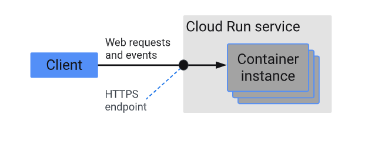

The agent will be a FastAPI application that uses Gemini 2.5 Pro as the LLM. We can use Vertex AI or AI Studio as the LLM provider using the Environment variable GOOGLE_GENAI_USE_VERTEXAI.


```bash
export GOOGLE_CLOUD_PROJECT=your-project-id # Your GCP project ID
export GOOGLE_CLOUD_LOCATION=us-central1 # Or your preferred location
export GOOGLE_GENAI_USE_VERTEXAI=true # Set to true if using Vertex AI
export GOOGLE_CLOUD_PROJECT_NUMBER=$(gcloud projects describe --format json $GOOGLE_CLOUD_PROJECT | jq -r ".projectNumber")
```
**Enable APIs and Permissions:**

```bash
gcloud services enable \
    container.googleapis.com \
    artifactregistry.googleapis.com \
    cloudbuild.googleapis.com \
    aiplatform.googleapis.com
```

**Deployment payload:**

The following content is uploaded to the service:

- Your ADK agent code
- Any dependencies declared in your ADK agent code
- ADK API server code version used by your agent
- The default deployment does not include the ADK web user interface libraries, unless you specify it as deployment setting, such as the --with_ui option for adk deploy gke command.


**Project structure:**

```bash
google_adk_psg/
├── .adk/
├── .env
├── .gitignore
├── Interview_simulator/
│   ├── __init__.py
│   ├── prompt.py
│   ├── router_agent.py
│   ├── sub_agents/
│   │   ├── analyzer_agent/
│   │   │   ├── __init__.py
│   │   │   ├── analyzer_agent.py
│   │   │   └── prompt.py
│   │   ├── interviewer_agent/
│   │   │   ├── __init__.py
│   │   │   ├── interviewer_agent.py
│   │   │   └── prompt.py
│   │   └── validation_agent/
│   │       ├── __init__.py
│   │       ├── prompt.py
│   │       └── validation_agent.py
│   └── tools/
│       ├── __init__.py
│       ├── document_parser.py
│       └── parse_tool.py
├── README.md
├── app.py
├── deployment/
│   └── deploy.py
├── dockerfile
├── images/
├── myenv/
├── requirements.txt
├── temp_Jd.docx
└── temp_PavanG_Resume_Base.docx
```

**Requirements:**

```bash
google-adk==1.22.1
google-cloud-aiplatform>=1.132.0,<2.0.0
google-generativeai>=0.5,<1.0
python-dotenv
python-docx
python-multipart
PyMuPDF
vertexai
fastapi
uvicorn
asyncio
```

**Step1: Build the container image:**

```bash
docker build -t interview-simulator .
```

**Step2: You need to create a Google Artifact Registry repository to store your container images. You can do this using the gcloud command line tool.**

```bash
gcloud artifacts repositories create adk-apps `
  --repository-format=docker `
  --location=us-central1 `
  --description="ADK apps container repo"
```
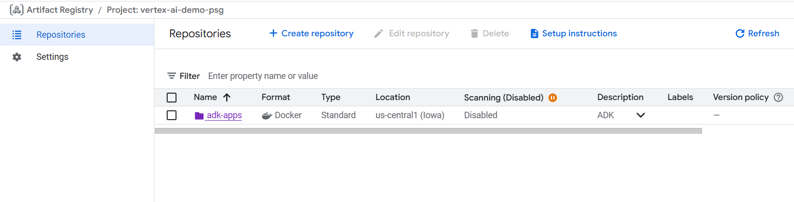

**Step3: Build the container image using the gcloud command line tool. This example builds the image and tags it as adk-repo/adk-agent:latest.**

```bash
gcloud builds submit . --tag us-central1-docker.pkg.dev/vertex-ai-demo-psg/adk-apps/interview-simulator
```


**Step4: Verify the image is built and pushed to the Artifact Registry:**

```bash
gcloud artifacts docker images list \
  $GOOGLE_CLOUD_LOCATION-docker.pkg.dev/$GOOGLE_CLOUD_PROJECT/adk-apps \
  --project=$GOOGLE_CLOUD_PROJECT
```
**Step5: Deploy the container image to Google Cloud Run:**

```bash
gcloud run deploy interview-simulator `
  --image us-central1-docker.pkg.dev/vertex-ai-demo-psg/adk-apps/interview-simulator `
  --platform managed `
  --region us-central1 `
  --allow-unauthenticated `
  --port 8080 `
  --memory 1Gi `
  --cpu 1
```

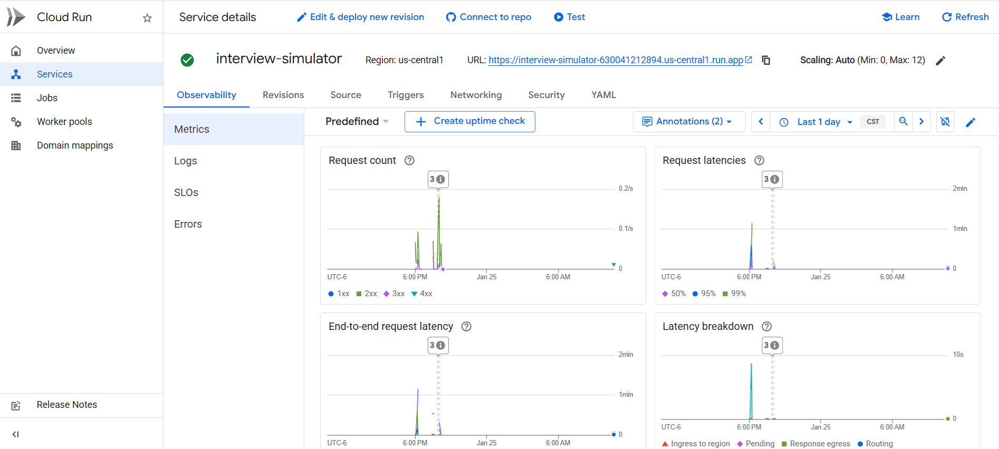

**Step6: Test the deployment:**

```bash
curl -X POST https://interview-simulator-630041212894.us-central1.run.app/chat -H "Content-Type: application/json" -d "{\"message\": \"Hi\", \"streaming\": false}"
```

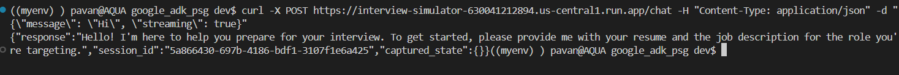

### 3. Google Kubernetes Engine (GKE):
Google Kubernetes Engine (GKE) is a managed Kubernetes service of Google Cloud that allows you to run your agent in a containerized environment. GKE is a good option if you need more control over the deployment as well as for running Open Models.


# Observability:

## 1. Logging in the Agent Development Kit (ADK):

The Agent Development Kit (ADK) uses Python's standard logging module to provide flexible and powerful logging capabilities. Understanding how to configure and interpret these logs is crucial for monitoring agent behavior and debugging issues effectively.

**How to Configure Logging:**

You can configure logging in your main application script (e.g., main.py) before you initialize and run your agent. The simplest way is to use logging.basicConfig.

```python
import logging

logging.basicConfig(
    level=logging.INFO,
    format='%(asctime)s - %(levelname)s - %(message)s'
)
```
**The available log levels for the --log_level option are:**

- DEBUG
- INFO (default)
- WARNING
- ERROR
- CRITICAL

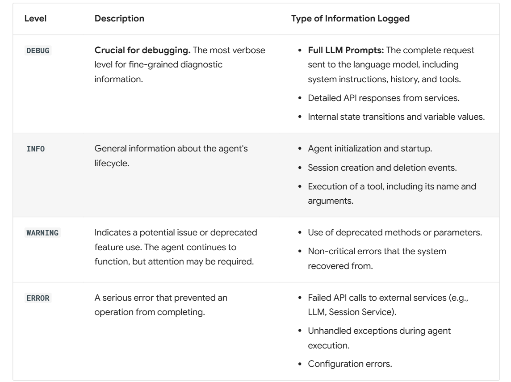

## 2. Cloud Trace:

With ADK, you’ve already capable of inspecting and observing your agent interaction locally. However, if we aim for cloud deployment, we will need a centralized dashboard to observe real traffic.

Cloud Trace is a component of Google Cloud Observability. It is a powerful tool for monitoring, debugging, and improving the performance of your applications by focusing specifically on tracing capabilities. For Agent Development Kit (ADK) applications, Cloud Trace enables comprehensive tracing, helping you understand how requests flow through your agent's interactions and identify performance bottlenecks or errors within your AI agents.

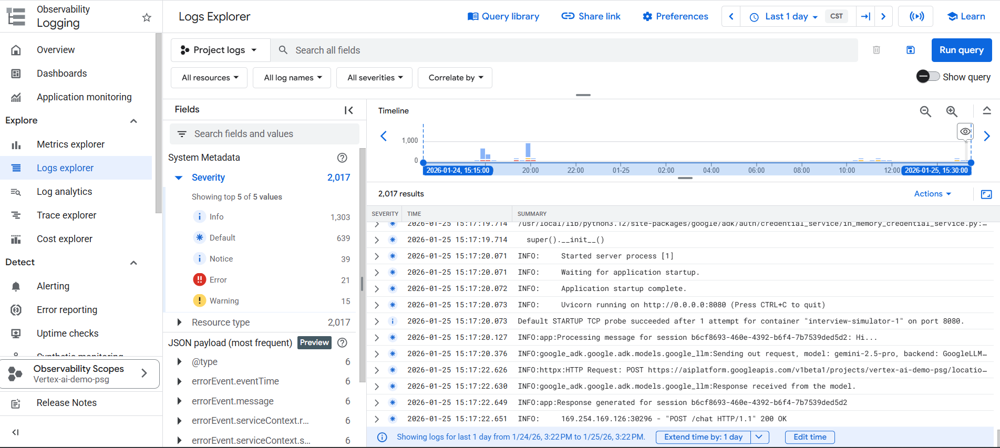

# Why Evaluate Agents:

- In traditional software development, unit tests and integration tests provide confidence that code functions as expected and remains stable through changes. These tests provide a clear "pass/fail" signal, guiding further development.

- However, LLM agents introduce a level of variability that makes traditional testing approaches insufficient.

- Instead, we need qualitative evaluations of both the final output and the agent's trajectory - the sequence of steps taken to reach the solution. This involves assessing the quality of the agent's decisions, its reasoning process, and the final result.

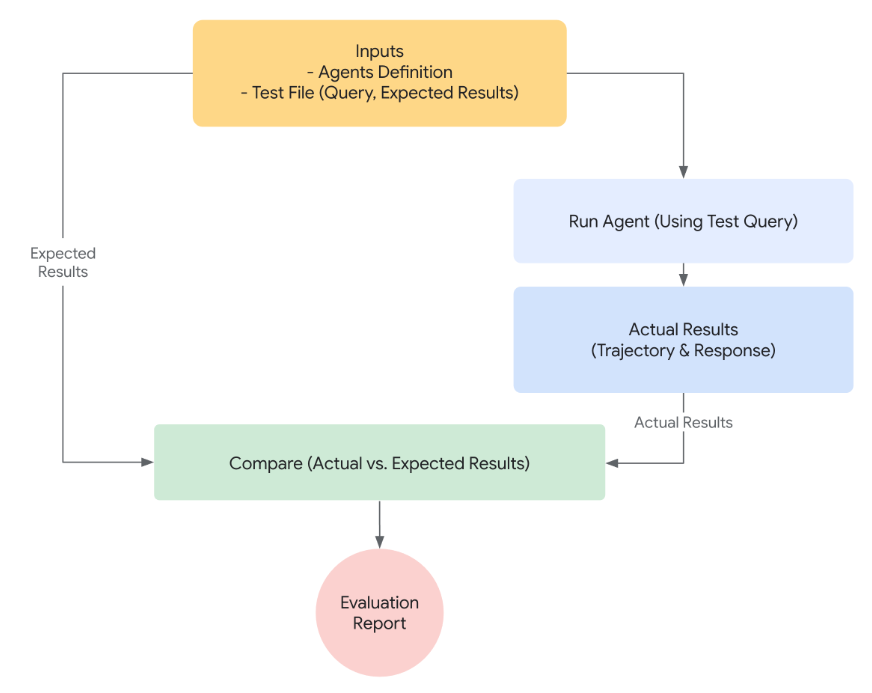


## What to Evaluate?:

To bridge the gap between a proof-of-concept and a production-ready AI agent, a robust and automated evaluation framework is essential. Unlike evaluating generative models, where the focus is primarily on the final output, agent evaluation requires a deeper understanding of the decision-making process. Agent evaluation can be broken down into two components:

- **Evaluating Trajectory and Tool Use:** Analyzing the steps an agent takes to reach a solution, including its choice of tools, strategies, and the efficiency of its approach.
- **Evaluating the Final Response:** Assessing the quality, relevance, and correctness of the agent's final output.


## How Evaluation works with the ADK:
The ADK offers two methods for evaluating agent performance against predefined datasets and evaluation criteria. While conceptually similar, they differ in the amount of data they can process, which typically dictates the appropriate use case for each.

**1. First approach: Using a test file**

This approach involves creating individual test files, each representing a single, simple agent-model interaction (a session). It's most effective during active agent development, serving as a form of unit testing. These tests are designed for rapid execution and should focus on simple session complexity. Each test file contains a single session, which may consist of multiple turns. A turn represents a single interaction between the user and the agent. Each turn includes

- **User Content:** The user issued query.

- **Expected Intermediate Tool Use Trajectory:** The tool calls we expect the agent to make in order to respond correctly to the user query.

- **Expected Intermediate Agent Responses:** These are the natural language responses that the agent (or sub-agents) generates as it moves towards generating a final answer. These natural language responses are usually an artifact of an multi-agent system, where your root agent depends on sub-agents to achieve a goal. These intermediate responses, may or may not be of interest to the end user, but for a developer/owner of the system, are of critical importance, as they give you the confidence that the agent went through the right path to generate final response.

- **Final Response:** The expected final response from the agent.

You can give the file any name for example evaluation.test.json. The framework only checks for the .test.json suffix, and the preceding part of the filename is not constrained. The test files are backed by a formal Pydantic data model. The two key schema files are Eval Set and Eval Case


**2. Second approach: Using An Evalset File:**

The evalset approach utilizes a dedicated dataset called an "evalset" for evaluating agent-model interactions. An evalset file contains multiple "evals," each representing a distinct session. Each eval consists of one or more "turns," which include the user query, expected tool use, expected intermediate agent responses, and a reference response.


## Evaluation Criteria:

ADK provides several built-in criteria for evaluating agent performance, ranging from tool trajectory matching to LLM-based response quality assessment.

Here is a summary of all the available criteria:

- **tool_trajectory_avg_score:** Exact match of tool call trajectory.

- **response_match_score:** ROUGE-1 similarity to reference response.

- **final_response_match_v2:** LLM-judged semantic match to a reference response.

- **rubric_based_final_response_quality_v1:** LLM-judged final response quality based on custom rubrics.

- **rubric_based_tool_use_quality_v1:** LLM-judged tool usage quality based on custom rubrics.

- **hallucinations_v1:** LLM-judged groundedness of agent response against context.

- **safety_v1:** Safety/harmlessness of agent response.

If no evaluation criteria are provided, the following default configuration is used:

- **tool_trajectory_avg_score:** Defaults to 1.0, requiring a 100% match in the tool usage trajectory.

- **response_match_score:** Defaults to 0.8, allowing for a small margin of error in the agent's natural language responses.

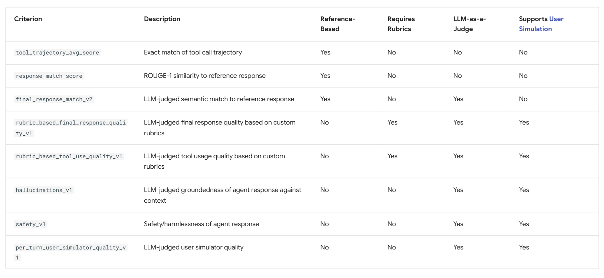


**Sample config file:**

```python
{
    "criteria": {
        "tool_trajectory_avg_score": {
            "threshold": 1.0,
            "match_type": "ANY_ORDER"
        },
        "response_match_score": {
            "threshold": 0.6
        },
        "final_response_match_v2": {
            "threshold": 0.7,
            "judge_model_options": {
                "judge_model": "gemini-2.5-flash",
                "num_samples": 3
            }
        }
    }
}

```

## Pytest Evaluation Method:
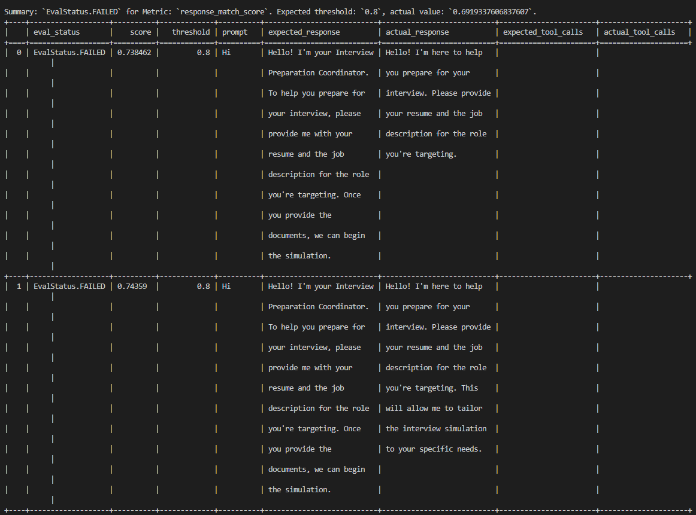

## ADK CLI Method:
``` bash

 adk eval `
>>   .\Interview_simulator `
>>   .\eval\data\interview_simulator.test.json `
>>   --config_file_path .\eval\eval_config.json `
>>   --print_detailed_results

```


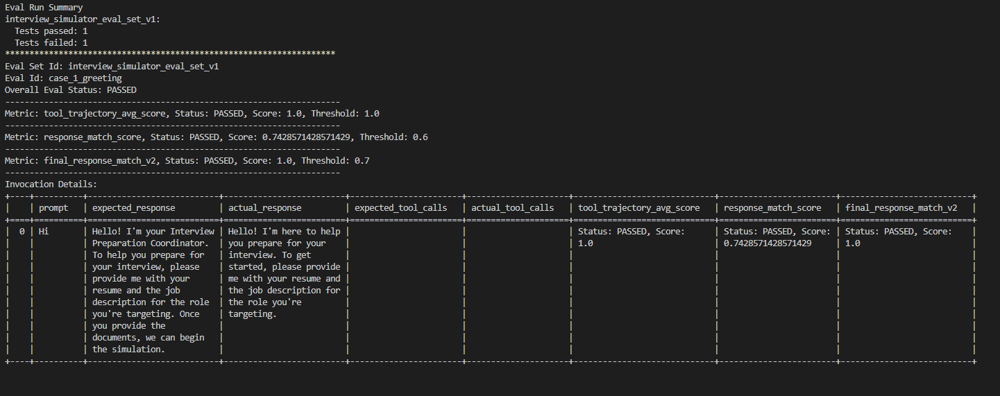

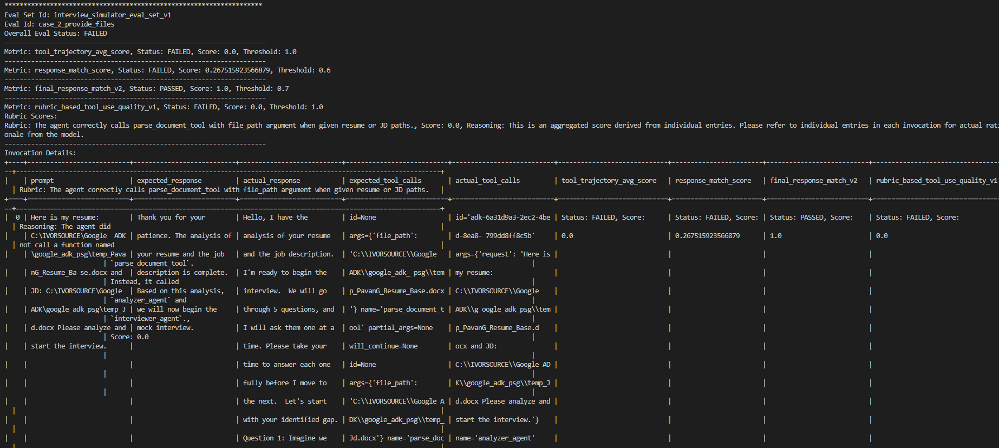

# Safety and Security for AI Agents:

As AI agents grow in capability, ensuring they operate safely, securely, and align with your brand values is paramount. Uncontrolled agents can pose risks, including executing misaligned or harmful actions, such as data exfiltration, and generating inappropriate content that can impact your brand’s reputation. Sources of risk include vague instructions, model hallucination, jailbreaks and prompt injections from adversarial users, and indirect prompt injections via tool use.

Google Cloud Vertex AI provides a multi-layered approach to mitigate these risks, enabling you to build powerful and trustworthy agents. It offers several mechanisms to establish strict boundaries, ensuring agents only perform actions you've explicitly allowed:

- **Identity and Authorization:** Control who the agent acts as by defining agent and user auth.
- **Guardrails to screen inputs and outputs:** Control your model and tool calls precisely.

  - **In-Tool Guardrails:** Design tools defensively, using developer-set tool context to enforce policies (e.g., allowing queries only on specific tables).

  - **Built-in Gemini Safety Features:** If using Gemini models, benefit from content filters to block harmful outputs and system Instructions to guide the model's behavior and safety guidelines

  - **Callbacks and Plugins:** Validate model and tool calls before or after execution, checking parameters against agent state or external policies.

  - **Using Gemini as a safety guardrail:** Implement an additional safety layer using a cheap and fast model (like Gemini Flash Lite) configured via callbacks to screen inputs and outputs.

- **Sandboxed code execution:** Prevent model-generated code to cause security issues by sandboxing the environment

- **Evaluation and tracing:** Use evaluation tools to assess the quality, relevance, and correctness of the agent's final output. Use tracing to gain visibility into agent actions to analyze the steps an agent takes to reach a solution, including its choice of tools, strategies, and the efficiency of its approach.

- **Network Controls and VPC-SC:** Confine agent activity within secure perimeters (like VPC Service Controls) to prevent data exfiltration and limit the potential impact radius.

**Harm categories:**

Content filters assess content based on the following harm categories:

| Harm Category        | Definition                                                                 |
|----------------------|-----------------------------------------------------------------------------|
| Hate Speech          | Negative or harmful comments targeting identity and/or protected attributes |
| Harassment           | Threatening, intimidating, bullying, or abusive comments targeting another individual |
| Sexually Explicit    | Contains references to sexual acts or other lewd content                     |
| Dangerous Content    | Promotes or enables access to harmful goods, services, and activities        |


``` bash
generative_models.SafetySetting(
  category=generative_models.HarmCategory.HARM_CATEGORY_DANGEROUS_CONTENT,
  threshold=generative_models.HarmBlockThreshold.BLOCK_ONLY_HIGH,
),

```


# References:
  -https://github.com/google/adk-samples/tree/main/python/agents/financial-advisor

  -https://google.github.io/adk-docs/deploy/

  -https://google.github.io/adk-docs/runtime/


## Multi Agent Architecture:

```mermaid
flowchart TD
    A[Start <br> User starts session] --> B[Router / Coordinator Agent <br> LlmAgent]

    subgraph "Main Flow"
        B -->|User provides JD + Resume| C[Call Analyzer Agent <br> via AgentTool]
        B -->|No documents yet| D[Ask user for resume + JD]
        D --> B

        C -->|parse_document tool <br>PDF/DOCX paths| E[Parse Resume & JD]
        E --> F[Extract keywords & gaps <br>Gemini reasoning]
        F --> G[Output: ===ANALYSIS_COMPLETE===]
        G -->|analyzer_result saved| H[Transition: Analysis done]

        H --> I[Call Interviewer Agent <br>via AgentTool]
        I --> J[Interviewer asks questions one-by-one <br>based on gaps + JD keywords]
        J --> K[User answers]
        K --> J
        J -->|User finishes / limit reached| L[Output: ===INTERVIEW_COMPLETE===]
        L -->|interviewer_result saved| M[Transition: Interview done]

        M --> N[Call Validator Agent <br>via AgentTool]
        N --> O[Score each answer 1–10 <br>Strengths / Weaknesses / Suggestions]
        O --> P[Overall summary <br>Average score + top areas]
        P --> Q[Output: ===VALIDATION_RESULTS===]
        Q -->|validation_results saved| R[Router shows full validation]

        R --> S[End session <br>Offer to restart or ask more]
    end

    %% Tools & Data flow
    E -->|parse_document_tool| T[Tools]
    I -->|google_search_tool| U[Google Search Tool <br> Live context]

    C -->|AgentTool| analyzer_agent[Analyzer Agent]
    I -->|AgentTool| interviewer_agent[Interviewer Agent]
    N -->|AgentTool| validator_agent[Validator Agent]

    %% Styling
    classDef router fill:#ffcc80,stroke:#d35400,stroke-width:2px,color:#000
    classDef agent fill:#a3e4d7,stroke:#16a085,stroke-width:2px,color:#000
    classDef tool fill:#f9e79f,stroke:#f1c40f,stroke-width:2px,color:#000
    classDef marker fill:#85c1e9,stroke:#2980b9,stroke-width:2px,color:#000

    class B router
    class analyzer_agent,interviewer_agent,validator_agent agent
    class T,U tool
    class G,L,Q marker

    %% Connections
    B --> analyzer_agent
    B --> interviewer_agent
    B --> validator_agent
    ```


